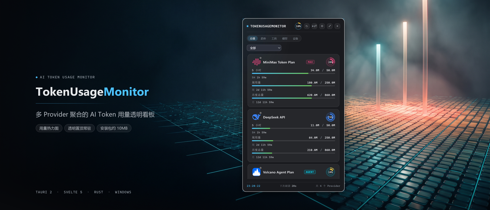

<div align="center">



# TokenUsageMonitor

**多 Provider 聚合的 AI Token 用量透明看板 · Windows 透明置顶挂件**

[](LICENSE)
[](#构建指南)
[](https://tauri.app)

English documentation: [README.en.md](README.en.md)

</div>

---

TokenUsageMonitor 是一个常驻桌面的轻量挂件：把各家 AI 服务商的额度余量、
本机 AI 编程工具的真实消耗、以及一个可给任意客户端挂载的本地模型路由代理，
汇总到一块 400×680 的透明置顶面板里。开发 AI 应用时，不用挨个打开控制台
就能随时掌握"还剩多少、烧得多快"。

## 功能特性

### 多 Provider 额度监控（多账户）

同一服务商可添加多个独立账户，每个账户有自定义标签、强调色与启停开关：

| 服务商 | 数据内容 | 鉴权方式 |
|---|---|---|
| DeepSeek | 余额 | API Key |
| Kimi (Moonshot) | 月度余额 | API Key |
| MiniMax | Token Plan 配额余量 | API Key |
| 火山方舟 | AgentPlan 配额 / API 推理用量 | AK/SK（HMAC 签名） |
| OpenAI | 订阅与账单用量 | API Key |
| xAI | 用量 | API Key |
| ChatGPT / Codex | 订阅用量 | 本机 `~/.codex/auth.json` |
| opencode Zen | 用量 | API Key |

### 本机 AI 工具用量账本

扫描本机会话日志，把 **Claude Code、Codex、ZCode、DeepSeek Harness (dsh)、
Cherry Studio、MiniMax Code、Hermes** 的真实 token 消耗（输入 / 缓存读 /
输出）汇入统一日账本，按日历、趋势、模型三个维度回看。

> 只读会话日志中的 usage 统计字段，**不读取对话内容**；支持把工具的
> 点目录重定位到任意盘符（按新鲜度择优，避免僵尸副本重复计数）。

### TokenRouter —— 本地模型路由代理

一个只监听 `127.0.0.1:43211` 的反向代理，兼容 Anthropic 与 OpenAI 两类
协议（`/v1/messages`、`/v1/chat/completions`、`/v1/responses`）：

- Claude Code / Codex 等 CLI 工具把 base URL 指向本机即可挂载；
- 每条路由链按 **四层判定** 换线：最小余量窗口主动预警 → 硬墙 →
  被动观测（429/404 等）→ 恢复探视切回；
- 工具自己的凭据**绝不透传给上游**，路由器注入候选账户自己的 Key；
- 响应旁路记账：经路由的每个请求的用量同样进入统一账本。

### 多端汇总

同一局域网内的多台电脑自动汇总用量（hub / agent / lan 三种角色 + mDNS
自动发现 + 共享密钥鉴权），详见下文[多端同步](#多端同步)。

### 桌面交互

透明置顶、屏幕贴边停靠、收成边缘胶囊、用量热力图、消耗速率与耗尽 ETA
预测、阈值分级通知（默认 80% 警告 / 95% 告急）、多币种成本估算（汇率可
手动覆盖）。

## 隐私与数据说明

本项目的设计底线：**用量数据只留在本机，不做任何遥测**。

- **零遥测**：代码里没有任何 analytics / crash 上报 / 遥测 SDK。
- **数据位置**：所有账本、缓存与设置都在 `%APPDATA%\com.tokenmonitor.app\`
  （SQLite + config.toml），卸载即消失，导出走你自选的本地文件。
- **凭证存储**：Provider API Key 存入 Windows 凭据管理器（DPAPI 加密）。
- **日志**：tracing 只输出到 stderr（开发诊断用），不落盘、不含凭证。

应用会主动发出的网络请求**只有**以下几类（其余时间零流量）：

| 目的 | 目标 |
|---|---|
| 你配置的 Provider 用量查询 | 各服务商官方 API |
| 本地路由代理的上游 | 你在路由线路里自己填的 base_url |
| 多端同步（开启后） | 你配置的 / mDNS 发现的局域网对端 |
| 汇率（成本估算） | open.er-api.com（免费、无 Key，24h 缓存） |
| 更新检查（默认关闭，需显式开启） | api.github.com |

需要如实告知的三点：

1. **本机扫描范围**：应用会读取上述 7 种工具的会话日志文件（仅 usage
   字段）。Windows 上还会自动枚举 WSL 发行版内的同名目录一并扫描
   （无独立开关；无 WSL 时静默跳过）。
2. **hub 共享密钥与路由 token** 以明文存在于 config.toml（Provider Key
   则在 DPAPI 保护的凭据管理器中）——请勿把 config.toml 分享给他人。
3. **多端同步走局域网明文 HTTP**，鉴权靠 Bearer 共享密钥（启用时自动
   生成 128 位密钥，也可显式清空关闭鉴权）。跨不可信网络时请勿开启。

详见 [SECURITY.md](SECURITY.md)。

## 构建指南

前置条件（Windows 10/11）：

- **Node.js** ≥ 20 与 npm
- **Rust** stable——本仓库用 `rust-toolchain.toml` 固定了
  `stable-x86_64-pc-windows-gnu` 工具链（无需 MSVC Build Tools），rustup
  会自动安装；链接器用 `rust-lld` + self-contained 导入库（见
  `src-tauri/.cargo/config.toml`），需要系统里有 LLVM-MinGW /
  MinGW-w64
- **WebView2** 运行时（Win11 自带；安装包内置引导器）
- NSIS 由 Tauri 在打包时自动获取，无需手动安装

```bash
npm install

# 开发调试
npm run tauri:dev

# 打包（NSIS 安装包 + MSI）
npm run tauri:build
```

测试与静态检查：

```bash
npm test            # vitest
npx svelte-check    # 前端类型检查
cd src-tauri && cargo test   # Rust 单元 + 集成测试
```

## TokenRouter 使用

1. 设置 → 路由：新建路由链，选择协议（Anthropic / OpenAI 兼容），
   添加候选线路（账户 + 上游模型 + base_url）；
2. 复制路由的 `tr_` API Key；
3. 在 CLI 工具中把 base URL 指向 `http://127.0.0.1:43211` 并填入该 Key
   （例如 Claude Code 的 `ANTHROPIC_BASE_URL` / `ANTHROPIC_AUTH_TOKEN`）；
4. 之后工具的每个请求都会按路由链选线，用量自动记账。

## 多端同步

设置 → 网络：

- **hub**：本机监听 `0.0.0.0:43210` 收其他设备上报；
- **agent**：本机把用量摘要（仅聚合数字，不含凭证与设置）每 30s 上报给
  指定 hub；
- **lan**：hub + mDNS 自动发现同网段对端，两两互报（全互连）；
- **off**：完全离线（默认）。

## 目录结构速览

```
src/                 Svelte 5 前端（主面板 / 设置 / 趋势 / 工具窗）
src-tauri/src/       Rust 后端
  ├─ providers/      各服务商用量 provider（统一 trait）
  ├─ local/          本机工具会话日志扫描
  ├─ router/         TokenRouter 本地路由代理
  ├─ hub.rs / p2p.rs 多端同步与 mDNS 发现
  └─ storage.rs      SQLite 统一日账本
docs/                设计文档与 UI 原型
```

## 致谢

设计与实现过程中参考了以下优秀项目：

- [qunqin24/Pulse](https://github.com/qunqin24/Pulse) —— macOS 屏幕边缘
  配额监控器，设置界面的分栏形态参考了它的设计范式
- [Javis603/token-monitor](https://github.com/Javis603/token-monitor)（MIT）——
  提供品牌图标矢量资源（`src/lib/brand-glyphs.ts`，按 MIT 条款保留版权声明）
- [junhoyeo/tokscale](https://github.com/junhoyeo/tokscale) —— 本机工具
  用量采集与账本思路的借鉴来源（详见
  [docs/benchmark-token-monitor-tokscale.md](docs/benchmark-token-monitor-tokscale.md)）
- [Tauri](https://tauri.app)、[Svelte](https://svelte.dev) —— 应用框架

## 免责声明

- 本项目为个人开发的第三方工具，**与所列各 AI 服务商均无关联、未经官方
  认可**；界面中出现的各服务商名称与 Logo 仅用于识别对应数据来源。
- 额度/用量数字来自各服务商 API 与本机会话日志解析，仅供参考，请以官方
  控制台为准。

## 许可证

以 [MIT](LICENSE-MIT) 或 [Apache-2.0](LICENSE-APACHE) 双许可发布
（SPDX: `MIT OR Apache-2.0`），你可以任选其一使用。
